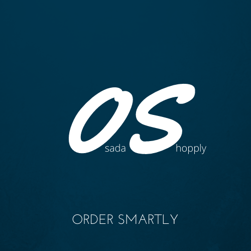

<!DOCTYPE html>
<html>
<head>

</head>

<body>
<h1 align="center"> Osada Shoply / Backend Application </h1>

  
   
  <i>
  Osada Shopply 
  Training Project / Mastering MEAN stack 
  GNU General Public License v3+
  </i>
  
   

<h2> Description </h2>

 Osada-Shoply is a simple system that emulates an online market (e-business). A simple authentication/authorization subsystem is in place, which will verify users and direct orders properly.  
The basic usecase scenario is imagined as follows:
<ul>
    <li>a user, say Grace, identifies/authenticates her identity</li>
    <li>She browses the list of available products</li>
    <li>She selects some of those to be added to her cart</li>
    <li>When Grace is satisfied with the cart, she can place an order, effectively purchasing all the items within her cart</li>
    <li>Grace can view all the history of her orders</li>
</ul>

Aside from that, some administration functionality is also available for adding/editing/removing products. All removals are intended to be "soft-deletes" as not to lose any information of past orders.

<h2> Demo </h2>

Naaah... just try it yourself. And don't forget the accompanying Front-end application from <a href="https://github.com/Rechard3/potential-shop">this repo</a>

<h2>Technologies</h2>

The server provides a RESTful API to manage the shop. 
Developed using a plethora of libraries, including express / Mongoose / lodash / {...expressUtils} and others.

<h2>Starting the Server</h2>

First, you need to have <code>NodeJS</code> and <code>npm</code> installed. You can easily get them from <a href="https://nodejs.org/downloads">NodeJS Downloads Page</a> 
After having installed NodeJS, you need to install the dependencies for this app:
navigate to the directory of this project (where the file <code>package.json</code> is located) and then type
<code>npm i</code> in the terminal. This should download all the necessary dependencies. 
You also need to configure the environment of the project. Create a folder inside this project and call it <code>env</code>. Inside it, create a file called <code>dev.env</code> and populate the following fields:

<ul>
    <li>NODE_ENV= {"prod" | "dev" | "test"}</li>
    <li>dbUser= username of the database admin user</li>
    <li>dbPass= password of the database admin user</li>
    <li>db= name of the database to use</li>
    <li>port= port to bind the server to</li>
    <li>sessionSecret=a secret string, must be a cryptographically secure random string, also must be long</li>
    <li>hashRounds= just use the value 12</li>
</ul>

These values are just environment variables, you can provide them however you feel fine. The default directory "env" and filename "dev.env" are loaded by the application automatically in tests, dev, and production modes. 
After doing this, you should be ready to run the server, just type <code>npm start</code> and it will start listening on port 3000 by default.

<h2>Automated Tests (Unit / Integration)</h2>

This project also includes some unit-tests (perhaps in the near future also integration tests). It uses Jasmine for Unit-testing. 
After having initialized the application, you can run the included automated tests simple by running <code>npm run test</code> in a terminal

<h2>License</h2>

    Copyright (C) 2020  <a href="mailto:omarabusaada93@gmail.com">Omar Abu Saada</a>

This program is free software: you can redistribute it and/or modify
it under the terms of the GNU General Public License as published by
the Free Software Foundation, either version 3 of the License, or
(at your option) any later version.

This program is distributed in the hope that it will be useful,
but WITHOUT ANY WARRANTY; without even the implied warranty of
MERCHANTABILITY or FITNESS FOR A PARTICULAR PURPOSE. See the
GNU General Public License for more details.

You should have received a copy of the GNU General Public License
along with this program. If not, see <a href="https://www.gnu.org/licenses/">https://www.gnu.org/licenses/</a>.

 
<h2> Not Accepting Contributions </h2>

</body>

</html>
